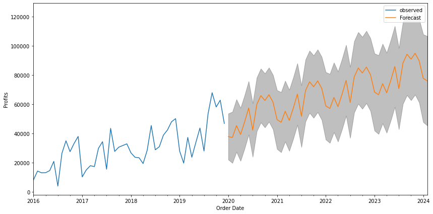

# Forecasting Sales And Identifying Anomalies In Journals For Private Equity Invesment

* This project was part of the Institute of Chartered Accountants in England and Wales (ICAEW) Private Equity (Data Analyst) course.
* A Private Equity firm is looking to invest in SuperStore, an international retailer that offers office supplies, furniture and technology. The firm wants to use Data Science to assess SuperStore's financial performance and management controls.
* The project used Python to identify any anomalous journal entries and whether segregation of duties in journal entries exists. It was found that management controls were breached only a few times.
* The financial performance required forecasting profits (using ARIMA) for the next four years across all regions to see if the net profit on sales increases by 10% annually, this condition was met as the forecast indicated a growth of 24%. Non-profitable regions (Western Africa) were identified and it was found that reducing the high value of discounts could turn these into a profitable region. Among the products, Tables have the highest discounts applied which leads to negative profits. The customer base of SuperStore is constant throughout the years, which indicates strong loyalty from existing customers, however, new customers should also be sought through marketing campaigns.
* A [Tableau dashboard](https://public.tableau.com/app/profile/shehab.shahid/viz/SuperStore_16453569346800/SuperStoreDashboard) is also available which shows global profits by County and products analysis.
* Overall, SuperStore only needs to address its management controls in order to acquire investment from the Private Equity firm.
* The following figure showcases the profits forecast (RMSE: 9741)

## Code used

### Python version: 3.8.8
### Packages: pandas, numpy, seaborn, matplotlib

## Data
The sales data was obtained from SuperStore (2016-2019), which is available from Tableau or Kaggle online. The Journals dataset was provided by ICAEW and is not available online. Only snippets of the dataset can be viewed in the Jupyter notebooks within this repo.

The sales dataset had missing values which were found and replaced from data within the dataset itself. The Journals dataset required merging and appending with the Accounts Team Staff dataset. Overall, both datasets were 100% complete.

There are three Jupyter Notebooks in this repo. Wrangling contains the data cleaning process. EDA consists of examining management controls and diagnostic analysis of sales. Profits Predictive Modelling contains the ARIMA model setup.
